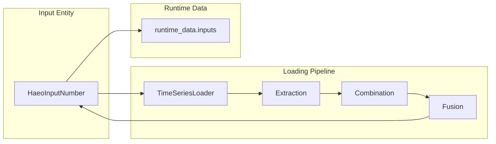

# Data Loading System

Technical guide to HAEO's unified time series loading architecture.

## Overview

The data loading system transforms Home Assistant sensor data into time series aligned with optimization horizons.
[Input entities](inputs.md) call this system to load and expose forecast data.

The system addresses three core challenges:

1. **Heterogeneous data sources**: Sensors provide different formats (simple values vs forecasts from various integrations)
2. **Temporal alignment**: Forecast timestamps rarely match optimization periods
3. **Partial coverage**: Forecasts often don't span the entire optimization horizon

The system uses a three-stage pipeline: extraction → combination → fusion.

See Home Assistant documentation for background on entities and sensors:

- [Entity state documentation](https://developers.home-assistant.io/docs/core/entity/)
- [Sensor platform guide](https://developers.home-assistant.io/docs/core/entity/sensor/)

## Architecture

The data loading pipeline consists of four stages:

1. **Orchestration** ([`TimeSeriesLoader`](https://github.com/hass-energy/haeo/blob/main/custom_components/haeo/core/data/loader/time_series_loader.py)) - Coordinates the entire loading process
2. **Extraction** ([`sensor_loader.py`](https://github.com/hass-energy/haeo/blob/main/custom_components/haeo/core/data/loader/sensor_loader.py)) - Reads Home Assistant entities and detects formats
3. **Combination** ([`forecast_combiner.py`](https://github.com/hass-energy/haeo/blob/main/custom_components/haeo/core/data/util/forecast_combiner.py)) - Merges multiple sensors into unified data
4. **Fusion** ([`forecast_fuser.py`](https://github.com/hass-energy/haeo/blob/main/custom_components/haeo/core/data/util/forecast_fuser.py)) - Aligns data to optimization horizon using interpolation

Input entities call `TimeSeriesLoader.load_intervals() or load_boundaries()` when they need to refresh their data.
The coordinator reads the already-loaded values from input entities.



Each stage has a single responsibility and clear interfaces, making the system testable and extensible.
Scalar-only fields bypass this pipeline and use a dedicated loader to read current values without forecasting.

### Design Decisions

**Why separate extraction and fusion?**
Extraction handles heterogeneous input formats, while fusion handles temporal alignment.
This separation allows adding new forecast formats without changing alignment logic.

**Why trapezoidal integration for fusion?**
Linear programming optimization works with energy (power × time), not instantaneous power.
Trapezoidal integration accurately computes interval averages from point samples.

**Why additive sensor combination?**
Physical intuition: multiple solar arrays sum their power output, multiple price components sum to total cost.
This matches real-world energy network behavior.

## TimeSeriesLoader

The [`TimeSeriesLoader`](https://github.com/hass-energy/haeo/blob/main/custom_components/haeo/core/data/loader/time_series_loader.py) orchestrates the complete loading pipeline.
[Input entities](inputs.md) instantiate and call this loader to refresh their forecast data.

### Responsibilities

- Validate that all referenced sensors exist and are available
- Coordinate extraction, combination, and fusion stages
- Convert results to HAEO base units (see [Units](units.md) for details)
- Handle single sensors and sensor lists uniformly

### Interface Design

The loader provides methods for two types of data loading:

- `available()` - Checks if sensors exist without loading data (used during config validation)
- `load_intervals()` - Returns n interval averages for n+1 fence post timestamps
- `load_boundaries()` - Returns n+1 point-in-time values at each fence post timestamp

**Intervals vs Fence Posts**:
Optimization horizons are defined by n+1 timestamps (fence posts) creating n periods (intervals).
Different physical quantities require different loading approaches:

- **Interval values** (n values): Power, efficiency, costs - values that represent averages over time periods
- **Fence post values** (n+1 values): Capacity, SOC limits - values that represent states at specific points in time

All methods accept flexible `value` parameters (single sensor string, list, or constant) to support different configuration field types.

### Return Behavior

The loading methods return lists of floats:

- `load_intervals()` returns n values (one per optimization period)
- `load_boundaries()` returns n+1 values (one per fence post timestamp)

Both handle constant values by broadcasting to the appropriate length.
Both support a `default` parameter for optional fields with fallback values.

Values use HAEO base units: kilowatts (kW) for power, kilowatt-hours (kWh) for energy, \$/kWh for prices.
See [Units documentation](units.md) for conversion details.

## ScalarLoader

The [`ScalarLoader`](https://github.com/hass-energy/haeo/blob/main/custom_components/haeo/core/data/loader/scalar_loader.py) handles fields with `time_series` set to `False`.
These inputs represent point-in-time values, such as initial SOC.
The loader reads the current sensor state, converts to base units, and sums multiple sensors when provided.
Scalar loading skips extraction, combination, and fusion because there is no horizon alignment step.

## Sensor Extraction

The [`sensor_loader.py`](https://github.com/hass-energy/haeo/blob/main/custom_components/haeo/core/data/loader/sensor_loader.py) module extracts data from Home Assistant entities.

### Payload Types

A sensor provides either:

- **Present value** (float): Current reading at query time
- **Forecast series** (list of timestamp/value tuples): Future predictions

This distinction drives all downstream processing: present values repeat across horizons, forecast series interpolate and cycle.

### Format Detection

The system uses duck typing to identify forecast formats.
Each integration has distinct attribute structures, allowing automatic detection without configuration.

The detection logic tries all known parsers (see [Extractors](#extractors)) and returns the first match.
If no parser matches, the system falls back to extracting the numeric state value.

### Why Automatic Detection?

Users shouldn't need to specify integration types in configuration.
Automatic detection reduces configuration complexity and prevents errors from misconfiguration.
Adding new forecast formats requires only a new parser module, not changes to user configuration.

## Extractors

The extractor system ([`extractors/`](https://github.com/hass-energy/haeo/tree/main/custom_components/haeo/core/data/loader/extractors)) handles integration-specific forecast formats.

### Supported Integrations

| Integration               | Use Case                     | Parser Module                                                                                                                                                   |
| ------------------------- | ---------------------------- | --------------------------------------------------------------------------------------------------------------------------------------------------------------- |
| Amber Electric            | Electricity pricing          | [`amberelectric.py`](https://github.com/hass-energy/haeo/blob/main/custom_components/haeo/core/data/loader/extractors/amberelectric.py)                         |
| AEMO NEM                  | Wholesale pricing            | [`aemo_nem.py`](https://github.com/hass-energy/haeo/blob/main/custom_components/haeo/core/data/loader/extractors/aemo_nem.py)                                   |
| EMHASS                    | Energy management forecasts  | [`emhass.py`](https://github.com/hass-energy/haeo/blob/main/custom_components/haeo/core/data/loader/extractors/emhass.py)                                       |
| Flow Power                | Electricity pricing          | [`flow_power.py`](https://github.com/hass-energy/haeo/blob/main/custom_components/haeo/core/data/loader/extractors/flow_power.py)                               |
| HAEO                      | Chaining HAEO sensor outputs | [`haeo.py`](https://github.com/hass-energy/haeo/blob/main/custom_components/haeo/core/data/loader/extractors/haeo.py)                                           |
| Nordpool                  | Electricity pricing          | [`nordpool.py`](https://github.com/hass-energy/haeo/blob/main/custom_components/haeo/core/data/loader/extractors/nordpool.py)                                   |
| Solcast Solar             | Solar forecasting            | [`solcast_solar.py`](https://github.com/hass-energy/haeo/blob/main/custom_components/haeo/core/data/loader/extractors/solcast_solar.py)                         |
| Volcast                   | Solar forecasting            | [`volcast.py`](https://github.com/hass-energy/haeo/blob/main/custom_components/haeo/core/data/loader/extractors/volcast.py)                                     |
| Open-Meteo Solar Forecast | Solar forecasting            | [`open_meteo_solar_forecast.py`](https://github.com/hass-energy/haeo/blob/main/custom_components/haeo/core/data/loader/extractors/open_meteo_solar_forecast.py) |

### Parser Design

Each parser is a standalone module with two responsibilities:

1. **Detection**: Identify if a sensor state matches the integration's format
2. **Extraction**: Parse forecast data into (Unix timestamp, value) tuples

Parsers declare expected units and device classes for automatic unit conversion.

### Adding New Formats

To support a new forecast integration:

1. Create a parser module in `extractors/`
2. Implement `detect()` and `extract()` static methods
3. Declare `DOMAIN`, `UNIT`, and `DEVICE_CLASS` class attributes
4. Add tests to `core/data/loader/extractors/tests/`

The system automatically discovers and uses new parsers without configuration changes.
See existing parsers for implementation patterns.

## Combining Payloads

The [`forecast_combiner.py`](https://github.com/hass-energy/haeo/blob/main/custom_components/haeo/core/data/util/forecast_combiner.py) module merges multiple sensor payloads.

### Combination Strategy

Multiple sensors combine additively:

- **Present values** sum together
- **Forecast series** interpolate to shared timestamps, then sum

This matches physical reality: two solar arrays produce combined power, multiple price components sum to total cost.

### Timestamp Alignment

When combining forecast series with different timestamps, the system:

1. Creates a union of all timestamps from all sensors
2. Interpolates each sensor's values to this common timestamp set
3. Sums interpolated values at each timestamp

This ensures no information loss when sensors report forecasts at different intervals (e.g., 30-minute vs hourly).

### Mixed Payloads

When some sensors provide present values and others provide forecasts, the present values become the initial forecast value.
The combination then proceeds as pure forecast series merging.

## Fusion to Horizon

The [`forecast_fuser.py`](https://github.com/hass-energy/haeo/blob/main/custom_components/haeo/core/data/util/forecast_fuser.py) module aligns combined forecasts to optimization horizons.

### Fusion Functions

The fuser provides two functions for different data types:

- `fuse_to_intervals()` - Produces n interval averages using trapezoidal integration
- `fuse_to_boundaries()` - Produces n+1 point-in-time values via interpolation

### Interval Fusion Strategy

The `fuse_to_intervals()` function produces values for each optimization period:

- Uses trapezoidal integration to compute accurate period averages
- Accounts for value changes within periods

This matches optimization requirements: linear programming operates on energy quantities (power × time), not instantaneous values.

### Fence Post Fusion Strategy

The `fuse_to_boundaries()` function produces values at each timestamp boundary:

- Uses linear interpolation to get values at exact fence post times
- Preserves point-in-time nature of quantities like capacity and SOC limits

This is appropriate for energy storage values that represent states at specific moments, not averages over periods.

### Interval Averaging

The system uses trapezoidal integration to compute accurate interval averages from point forecasts.
This accounts for value changes within optimization periods, producing more accurate results than simple point sampling or nearest-neighbor approaches.

**Why trapezoidal integration?**
Energy (kWh) = Power (kW) × Time (h).
Optimization operates on energy quantities, so we need accurate power-over-time averaging.
Trapezoidal integration provides the best balance of accuracy and simplicity for linear interpolation.

### Forecast Cycling

When forecasts don't cover the full horizon, the system cycles them using natural period alignment.
See [Forecast Cycling](#forecast-cycling) for details.

The cycling happens before fusion, ensuring the fusion always has data covering beyond the last horizon timestamp.

## Forecast Cycling

The [`forecast_cycle.py`](https://github.com/hass-energy/haeo/blob/main/custom_components/haeo/core/data/util/forecast_cycle.py) module handles partial forecast coverage.

### Natural Period Alignment

Forecasts cycle at their natural period (24 hours for daily patterns, 7 days for weekly patterns, etc.).
The system identifies this period automatically by detecting when forecast timestamps align with 24-hour boundaries.

**Why natural periods?**
Different forecast types have different inherent cycles:

- Electricity prices often have daily patterns (time-of-use pricing)
- Some forecasts span multiple days (7-day solar forecasts)
- Cycling should preserve the forecast's intended pattern

### Time-of-Day Preservation

When cycling, the system maintains time-of-day alignment.
A 6-hour forecast from 2pm-8pm repeats at the same times each day, not offset by arbitrary amounts.

This ensures realistic patterns: expensive electricity in the evening stays expensive in the evening on subsequent days.

### Design Rationale

Cycling is necessary because users configure long optimization horizons (48-168 hours) but integrations provide shorter forecasts.
Simply repeating the last value would lose time-of-day patterns.
Wrapping to zero would produce unrealistic gaps.
Natural period cycling preserves patterns while extending coverage.

## Error Handling

The data loading system uses `ValueError` for all data problems.
Coordinators catch these and convert them to appropriate Home Assistant exceptions based on context.

### Error Strategy

- **Transient errors** (sensor offline, API timeout) → `UpdateFailed` (coordinator retries)
- **Permanent errors** (invalid sensor ID, wrong device class) → `ConfigEntryError` (user must fix configuration)

This separation ensures temporary issues don't require user intervention while permanent problems surface immediately.

### Error Messages

All error messages include specific sensor entity IDs and actionable guidance.
Users should be able to identify the problem sensor and understand how to fix it without reading code or logs.

## Testing

Tests are colocated with source code:

- [`core/data/loader/tests/`](https://github.com/hass-energy/haeo/tree/main/custom_components/haeo/core/data/loader/tests) - Extraction and loading tests
- [`core/data/util/tests/`](https://github.com/hass-energy/haeo/tree/main/custom_components/haeo/core/data/util/tests) - Combination and fusion tests
- [`core/data/loader/extractors/tests/`](https://github.com/hass-energy/haeo/tree/main/custom_components/haeo/core/data/loader/extractors/tests) - Format-specific parser tests

### Test Strategy

**Unit tests** cover individual functions (extraction, combination, fusion, cycling) in isolation.
**Integration tests** verify the complete pipeline from sensor IDs to horizon-aligned values.

Each test uses realistic fixtures based on actual integration data formats.
This ensures parsers handle real-world edge cases (missing fields, unexpected value ranges, timezone handling).

### Running Tests

```bash
# All data loading tests
uv run pytest custom_components/haeo/core/data/ -v

# Specific component
uv run pytest custom_components/haeo/core/data/loader/tests/test_time_series_loader.py -v

# With coverage report
uv run pytest custom_components/haeo/core/data/ --cov=custom_components.haeo.core.data
```

## Related Documentation

<div class="grid cards" markdown>

- :material-import:{ .lg .middle } **Input Entities**

    ---

    How input entities use the loading system.

    [:material-arrow-right: Input entities guide](inputs.md)

- :material-file-document:{ .lg .middle } **Forecasts and Sensors guide**

    ---

    User-facing documentation for sensor behavior.

    [:material-arrow-right: Forecasts and Sensors](../user-guide/forecasts-and-sensors.md)

- :material-ruler:{ .lg .middle } **Units**

    ---

    Unit conversion system and base units.

    [:material-arrow-right: Units guide](units.md)

- :material-sync:{ .lg .middle } **Coordinator**

    ---

    How coordinator reads loaded data.

    [:material-arrow-right: Coordinator guide](coordinator.md)

</div>
