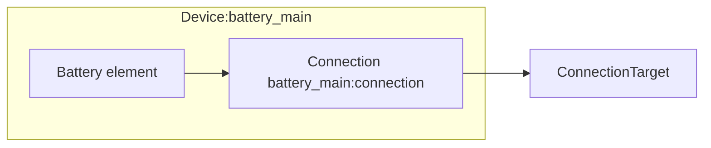

# Battery Modeling

The Battery device composes a single [Battery model](../model-layer/elements/battery.md) element and a single [Connection](../model-layer/connections/connection.md).
SOC preferences are encoded directly in the connection via the SOC pricing segment.

## Model Elements Created

The adapter creates two model elements:

| Model Element                                          | Name               | Parameters From Configuration                    |
| ------------------------------------------------------ | ------------------ | ------------------------------------------------ |
| [Battery](../model-layer/elements/battery.md)          | `{name}`           | Capacity range, initial charge, salvage value    |
| [Connection](../model-layer/connections/connection.md) | `{name}:discharge` | Efficiency, power limits, SOC pricing (optional) |
| [Connection](../model-layer/connections/connection.md) | `{name}:charge`    | Efficiency, power limits                         |

## Architecture Details

### Capacity range and offsets

The battery model tracks stored energy within a bounded range:

- **Lower bound**: undercharge percentage when configured, otherwise `min_charge_percentage`
- **Upper bound**: overcharge percentage when configured, otherwise `max_charge_percentage`

The model capacity is:

$$
C_{\text{model}}(t) = (\text{upper\%}(t) - \text{lower\%}(t)) \cdot C(t)
$$

Stored energy is measured relative to the lower bound.
User-facing energy and SOC add the lower bound offset back to the model values.

### SOC pricing segment

When undercharge or overcharge costs are configured, the connection includes the SOC pricing segment:

- **Undercharge penalty** applies when SOC falls below `min_charge_percentage`
- **Overcharge penalty** applies when SOC rises above `max_charge_percentage`

These are soft constraints driven by cost.
The battery can operate outside the preferred range when prices justify it, but it will never exceed the configured lower/upper bounds.

### Salvage value

The battery element can include a terminal salvage value.
This assigns a per-kWh value to the final stored energy at the horizon end.
It discourages draining the battery to zero when energy is still valuable beyond the forecast window.

## Devices Created

Battery creates a single Home Assistant device:

| Device  | Name     | Created When | Purpose                           |
| ------- | -------- | ------------ | --------------------------------- |
| Battery | `{name}` | Always       | Power, energy, SOC, shadow prices |

## Parameter mapping

| User Configuration          | Model Element(s)      | Model Parameter                            | Notes                          |
| --------------------------- | --------------------- | ------------------------------------------ | ------------------------------ |
| `capacity`                  | Battery               | Capacity range from lower/upper SOC bounds | kWh, boundaries                |
| `initial_charge_percentage` | Battery               | `initial_charge` (offset by lower bound)   | kWh                            |
| `min_charge_percentage`     | Battery + SOC pricing | Preferred minimum SOC threshold            | Penalty threshold              |
| `max_charge_percentage`     | Battery + SOC pricing | Preferred maximum SOC threshold            | Penalty threshold              |
| Undercharge percentage      | Battery               | Lower bound for SOC range                  | Hard minimum                   |
| Overcharge percentage       | Battery               | Upper bound for SOC range                  | Hard maximum                   |
| Undercharge cost            | SOC pricing segment   | `discharge_energy_price`                   | Penalty below min SOC          |
| Overcharge cost             | SOC pricing segment   | `charge_capacity_price`                    | Penalty above max SOC          |
| `salvage_value`             | Battery               | `salvage_value`                            | Terminal value for stored kWh  |
| `efficiency_source_target`  | Efficiency segment    | `efficiency_source_target`                 | Battery to network (discharge) |
| `efficiency_target_source`  | Efficiency segment    | `efficiency_target_source`                 | Network to battery (charge)    |
| `max_power_target_source`   | Power-limit segment   | `max_power_target_source`                  | Network to battery             |
| `max_power_source_target`   | Power-limit segment   | `max_power_source_target`                  | Battery to network             |

## Output Mapping

The adapter maps model outputs directly from the battery element:

| Model Output              | Sensor Name                         | Description                |
| ------------------------- | ----------------------------------- | -------------------------- |
| `BATTERY_POWER_CHARGE`    | `power_charge`                      | Charge power               |
| `BATTERY_POWER_DISCHARGE` | `power_discharge`                   | Discharge power            |
| `BATTERY_ENERGY_STORED`   | `energy_stored`                     | Total energy stored        |
| Calculated SOC            | `state_of_charge`                   | State of charge            |
| `BATTERY_POWER_BALANCE`   | `power_balance_shadow_energy_price` | Power balance shadow price |
| `BATTERY_ENERGY_IN_FLOW`  | `energy_in_flow`                    | Energy-in shadow price     |
| `BATTERY_ENERGY_OUT_FLOW` | `energy_out_flow`                   | Energy-out shadow price    |
| `BATTERY_SOC_MAX`         | `soc_max`                           | Max SOC shadow price       |
| `BATTERY_SOC_MIN`         | `soc_min`                           | Min SOC shadow price       |

See [Battery Configuration](../../user-guide/elements/battery.md#sensors-created) for complete sensor documentation.

## Next Steps

- :material-file-document:{ .lg .middle } **Battery configuration**

    ---

    Configure batteries in your Home Assistant setup.

    [:material-arrow-right: Battery configuration](../../user-guide/elements/battery.md)

- :material-battery-charging:{ .lg .middle } **Battery model**

    ---

    Mathematical formulation for battery storage.

    [:material-arrow-right: Battery model](../model-layer/elements/battery.md)

- :material-connection:{ .lg .middle } **Connection model**

    ---

    How power limits, efficiency, and pricing are applied.

    [:material-arrow-right: Connection formulation](../model-layer/connections/connection.md)

