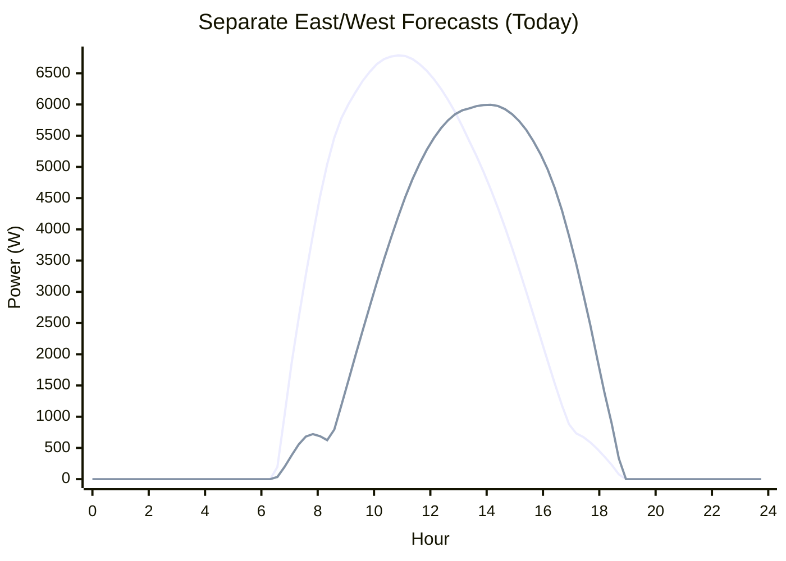
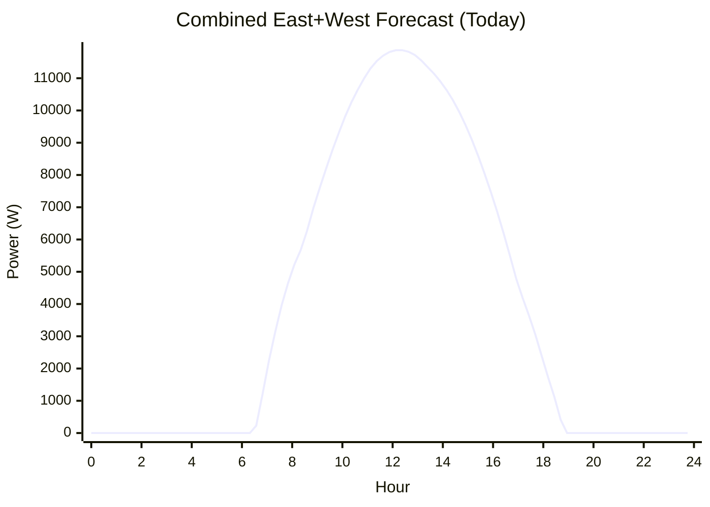
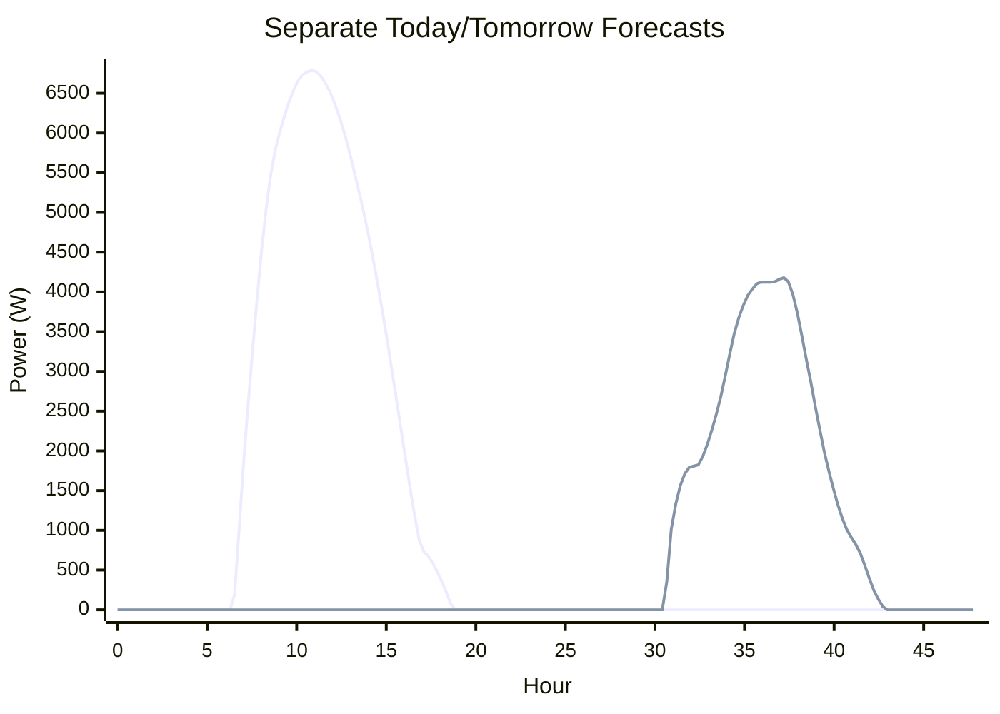
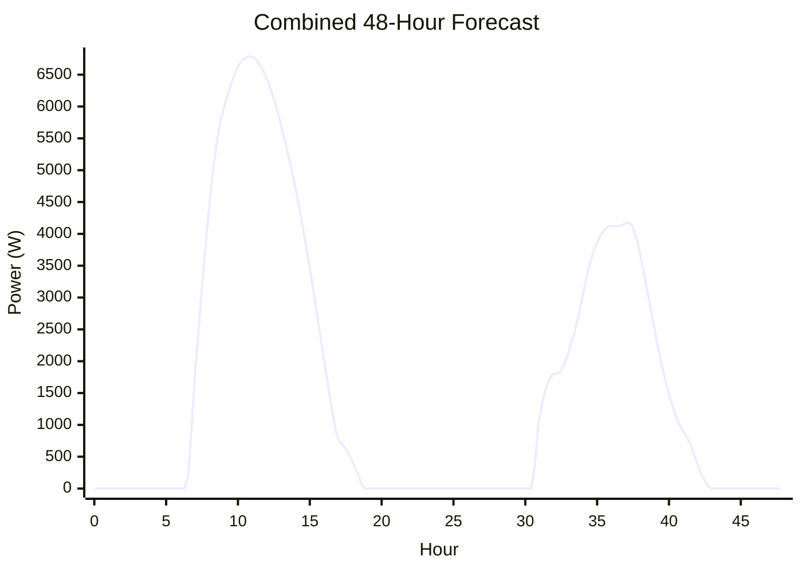
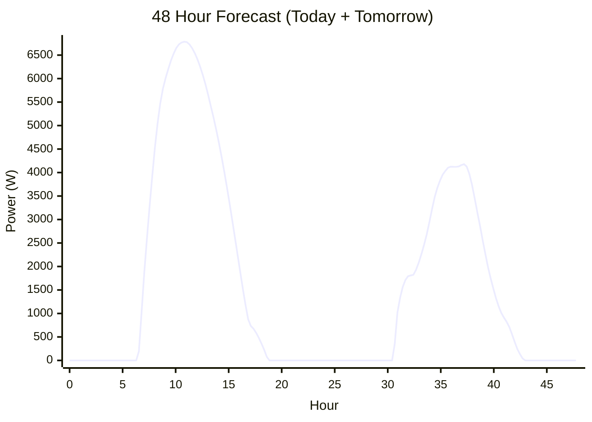
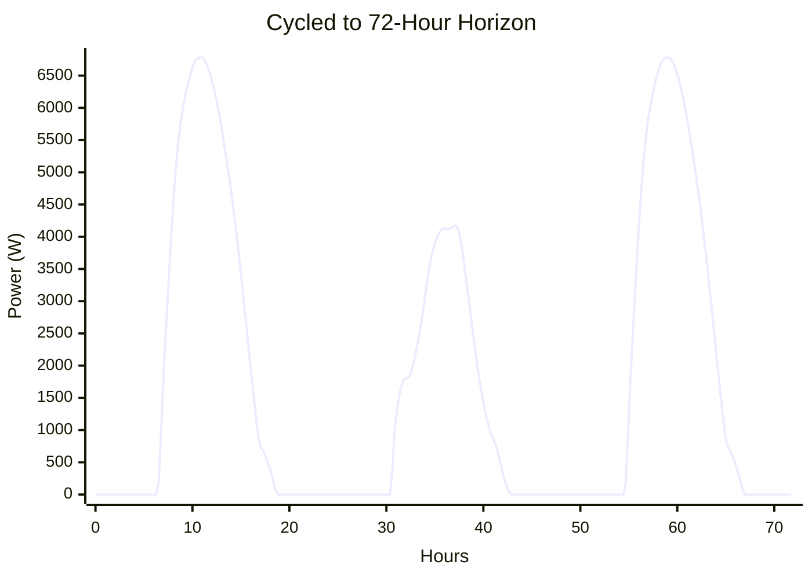

# Forecasts and Sensors

This guide explains how HAEO uses Home Assistant sensor data to optimize your energy network.

## Overview

HAEO loads data from Home Assistant sensors to understand:

- **Electricity prices** for import and export
- **Solar generation** forecasts
- **Load consumption** patterns

Each sensor provides either a current value or a forecast series, never both.
HAEO automatically detects what data each sensor exposes and combines everything into a unified time series aligned with your optimization horizon.

## How HAEO Uses Sensor Data

When you configure an element like a grid or solar system, you provide one or more sensor entity IDs.
HAEO reads these sensors and extracts either:

- **Present value**: The current sensor reading at the moment optimization starts (for simple sensors)
- **Forecast series**: A list of future timestamped predictions (for forecast-capable sensors)

These values are then processed to create a complete time series covering your optimization horizon.

## Single Sensor Values

The simplest case is a sensor that only provides a current value without any forecast data.

**Example**: A sensor showing current grid import price:

```yaml
entity_id: sensor.current_electricity_price
state: 0.25
```

HAEO reads the value (0.25 \$/kWh) and repeats it for every time step in your optimization horizon.
When you configure a sensor that only provides a present value, that value is used for all optimization periods.

### Scalar-only fields

Some configuration fields are scalar-only and do not create forecasts.
For example, the [Current charge percentage field](elements/battery.md#current-charge-percentage) uses the present value at optimization start to set the initial battery SOC.
HAEO reads the current sensor state and does not repeat it across the horizon for these fields.

## Forecast Sensors

Some sensors provide structured forecast data instead of a simple current value.
HAEO automatically detects and parses forecast attributes from supported integrations.
Custom template sensors that match these formats will also work.

**Supported formats** (see [Supported Forecast Formats](#supported-forecast-formats) for complete details):

- [HAFO](https://hafo.haeo.io)
- [Amber Electric](https://www.home-assistant.io/integrations/amberelectric/) (electricity pricing)
- [AEMO NEM](https://github.com/cabberley/HA_AemoNemData) (Australian electricity pricing)
- [EMHASS](https://github.com/davidusb-geern/emhass) (energy management forecasts)
- [Nordpool](https://github.com/custom-components/nordpool) (electricity pricing)
- [Solcast Solar](https://github.com/BJReplay/ha-solcast-solar) (solar generation)
- [Volcast](https://github.com/volter-labs/volcast-ha-integration) (solar generation)
- [Open-Meteo Solar Forecast](https://github.com/rany2/ha-open-meteo-solar-forecast) (solar generation)
- HAEO sensors (chain HAEO outputs as inputs to other elements)

**Example**: Amber Electric sensor with pricing forecast:

```yaml
entity_id: sensor.amber_general_price
state: 0.28
attributes:
  forecasts:
    - start_time: '2025-11-10T14:00:00+10:00'
      per_kwh: 0.28
    - start_time: '2025-11-10T14:30:00+10:00'
      per_kwh: 0.32
    - start_time: '2025-11-10T15:00:00+10:00'
      per_kwh: 0.29
```

### Interpolation Behavior

Forecast values are interpolated using trapezoidal integration to compute interval averages.
This means HAEO calculates the average power or price over each optimization period, not just point samples.

For the optimization horizon:

- **Position 0**: Present value at the horizon start time
- **Position 1+**: Average value over each subsequent time interval

This approach accurately represents energy consumption and costs over time.

### Unit Conversion

HAEO automatically converts sensor units to the internal representation used for optimization.
You don't need to create template sensors for unit conversion.

**Power conversions**:

- W (watts) → kW (kilowatts)
- MW (megawatts) → kW (kilowatts)

**Energy conversions**:

- Wh (watt-hours) → kWh (kilowatt-hours)
- MWh (megawatt-hours) → kWh (kilowatt-hours)

**Example**: If your battery sensor reports power in watts (`sensor.battery_power` = 5000 W), HAEO automatically converts this to 5 kW for optimization.

All HAEO output sensors use kilowatts (kW) for power and kilowatt-hours (kWh) for energy, regardless of input sensor units.

## Multiple Sensors

You can provide multiple sensors for any field that accepts sensor(s).
HAEO combines them automatically.

**How combining works**:

- Present values **sum together**
- Forecast series **merge on shared timestamps and sum**
- Result: combined present value + combined forecast series

**Example scenarios**:

**Scenario 1: Two forecast sensors**

```yaml
sensor_1: sensor.solar_rooftop_forecast
# Provides forecast series [...array 1 predictions...]

sensor_2: sensor.solar_ground_forecast
# Provides forecast series [...array 2 predictions...]

# Result: Forecast series (sum of both arrays at each timestamp)
```

**Scenario 2: One forecast sensor, one simple sensor**

```yaml
sensor_1: sensor.solar_array_forecast
# Provides forecast series [...predictions...]

sensor_2: sensor.constant_load
# Provides current value: 1.5 kW

# Result: Forecast series (array predictions) + 1.5 kW at each timestamp
```

This makes it easy to model multiple solar arrays, price components, or load sources without manual calculation.

### Visual Example: Combining Two Solar Arrays

When you configure two solar arrays for a solar element, HAEO sums their forecasts at each timestamp.
This example uses real data from an east-facing and west-facing array:

<div class="grid grid-cols-2 gap-4">





</div>

**Legend**: First chart shows east array (blue) and west array (orange) separately. East array peaks in the morning, west array peaks in the afternoon. Second chart shows their combined output summed at each timestamp.

The combined output provides more consistent generation throughout the day.

## Multiple Forecast Windows

Many integrations provide separate forecasts for different time windows (today, tomorrow, day-after-tomorrow).
Combine them using multiple sensors:

| Field     | Value                                                       |
| --------- | ----------------------------------------------------------- |
| **Power** | sensor.solar_forecast_today, sensor.solar_forecast_tomorrow |

HAEO merges all forecast series on shared timestamps and sums values.
This gives you complete horizon coverage from multiple shorter forecast windows.

### Visual Example: Combining Today and Tomorrow Forecasts

When you provide both today's and tomorrow's forecasts, HAEO seamlessly combines them.
This example shows the north array with different weather conditions each day:

<div class="grid grid-cols-2 gap-4">





</div>

**Legend**: First chart shows today's forecast (blue) reaching ~6.8kW peak and tomorrow's forecast (orange) with lower ~4.2kW peak due to cloudier conditions. Second chart shows the seamless combined 48-hour coverage.

Notice how tomorrow's partly cloudy forecast shows lower generation than today's clear-sky conditions.
HAEO uses the actual forecast data for each day rather than assuming identical patterns.

## Forecast Coverage and Cycling

Forecasts don't always cover your entire optimization horizon.
HAEO handles partial coverage automatically through **forecast cycling**.

### How Cycling Works

When forecast data ends before your horizon:

1. **Single sensor values** repeat for the entire horizon (already covered above)
2. **Forecast series** cycle using natural period alignment

**Natural period alignment** means HAEO identifies the pattern duration in your forecast and repeats it intelligently:

- A 6-hour forecast from 2pm-8pm cycles to show the same 2pm-8pm pattern for subsequent days
- A weekly forecast cycles weekly, preserving your full week pattern
- Daily patterns like electricity pricing maintain realistic time-of-day structure

This ensures optimization always uses plausible data rather than assuming zero values or constant prices.

### What You'll See

If your optimization horizon is 48 hours but you only have a 24-hour forecast:

- Hours 0-24: Actual forecast data (interpolated)
- Hours 24-48: First 24 hours repeated with time-of-day alignment

For multi-day forecasts (like a 7-day solar forecast), the full pattern cycles at its natural period.

### Visual Example: 24-Hour Forecast Cycling to 72 Hours

When your horizon exceeds forecast coverage, HAEO cycles the pattern with time-of-day alignment.
This example shows a single 48-hour north-facing solar array forecast extended to 72 hours:

<div class="grid grid-cols-2 gap-4">





</div>

**Legend**: First chart shows the combined 48-hour forecast from today and tomorrow. Second chart shows the same 48 hours repeated starting at hour 48 to fill the 72-hour horizon.

Note how the 48-hour pattern repeats starting at hour 48, maintaining realistic time-of-day generation profiles.

## Supported Forecast Formats

HAEO automatically detects and parses these forecast formats:

| Integration                                                                        | Domain                      | Use Case                        | Format              |
| ---------------------------------------------------------------------------------- | --------------------------- | ------------------------------- | ------------------- |
| [Amber Electric](https://www.home-assistant.io/integrations/amberelectric/)        | `amberelectric`             | Electricity pricing (Australia) | 30-minute intervals |
| [AEMO NEM](https://www.home-assistant.io/integrations/aemo/)                       | `aemo`                      | Wholesale pricing (Australia)   | 30-minute intervals |
| [EMHASS](https://github.com/davidusb-geern/emhass)                                 | `emhass`                    | Energy management forecasts     | Variable intervals  |
| HAEO                                                                               | `haeo`                      | Chain HAEO outputs as inputs    | Variable intervals  |
| [Nordpool](https://github.com/custom-components/nordpool)                          | `nordpool`                  | Electricity pricing (Europe)    | Variable intervals  |
| [HAFO](https://hafo.haeo.io)                                                       | `hafo`                      | Historical load forecasting     | Hourly intervals    |
| [Solcast Solar](https://github.com/BJReplay/ha-solcast-solar)                      | `solcast_pv_forecast`       | Solar generation                | 30-minute intervals |
| [Volcast](https://github.com/volter-labs/volcast-ha-integration)                   | `volcast`                   | Solar generation                | 5-minute intervals  |
| [Open-Meteo Solar Forecast](https://github.com/rany2/ha-open-meteo-solar-forecast) | `open_meteo_solar_forecast` | Solar generation                | Hourly intervals    |

Format detection is automatic—you don't need to specify the integration type.

## Creating Custom Forecast Sensors

You can create custom forecast sensors using Home Assistant templates.
The forecast must be a list of dictionaries with time and value keys.
Times should be either DateTime objects or ISO8601 compatible strings.
Time strings without a timezone are treated as the local time of Home Assistant instance.

**Example**: Custom load forecast sensor:

```yaml
template:
  - sensor:
      - name: Custom Load Forecast
        state: "{{ states('sensor.current_load') }}"
        unit_of_measurement: kW
        device_class: power
        attributes:
          forecast:
            - time: '{{ (now() + timedelta(hours=1)).isoformat() }}'
              value: 2.5
            - time: '{{ (now() + timedelta(hours=2)).isoformat() }}'
              value: 3.0
            - time: '{{ (now() + timedelta(hours=3)).isoformat() }}'
              value: 2.8
```

**Requirements**:

- `state` must be a numeric value (current reading)
- `unit_of_measurement` must match the element's expected unit (kW for power, \$/kWh for prices)
- `device_class` should be set appropriately (`power`, `monetary`)
- `forecast` attribute must contain timestamp/value pairs

HAEO will detect this as a simple forecast format and extract the data.

## Using Constants vs Sensors

For values that don't change over time (fixed prices, baseline loads, power limits), you have two options:

### Direct constant entry

During element configuration, select **Constant** for the field and enter your value directly in the form.
This is the simplest approach for truly static values.

| Selection | Value | Use Case                      |
| --------- | ----- | ----------------------------- |
| Constant  | 0.25  | Fixed price (source → target) |
| Constant  | 15    | Static power limit            |
| Constant  | 90    | Fixed SOC percentage          |

### Input number helpers

For values you want to adjust through the Home Assistant UI without reconfiguring HAEO, use [input_number helpers](https://www.home-assistant.io/integrations/input_number/).

**Creating an input_number**:

1. Navigate to **Settings** → **Devices & Services** → **Helpers**
2. Click **Create Helper** button
3. Select **Number**
4. Configure:
    - **Name**: Descriptive name (e.g., "Base Load Power", "Fixed Price (source → target)")
    - **Unit of measurement**: Match the element's expected unit (kW, \$/kWh, %, etc.)
    - **Minimum/Maximum**: Set reasonable bounds
    - **Initial value**: Set your desired constant
5. Click **Create**

**Using in HAEO configuration**:

During element configuration, select the input_number entity in the entity selector:

| Field                           | Value                                  |
| ------------------------------- | -------------------------------------- |
| **Price (source → target)**     | input_number.fixed_price_source_target |
| **Max Power (source → target)** | input_number.max_power_source_target   |

HAEO treats input_number helpers like any other sensor, reading the current value and repeating it across the optimization horizon.

**Benefits of input_number helpers**:

- Adjustable through Home Assistant UI without reconfiguring HAEO
- Can be controlled via automations or scripts
- Value changes take effect on next optimization cycle

**When to use each approach**:

- **Constant**: Values that rarely change (capacity, efficiency) - enter a fixed value directly
- **Entity with input_number**: Values you adjust regularly (target SOC, temporary overrides) - select the input_number helper
- **Entity with forecast sensor**: Values that vary over time (prices, solar generation) - select the forecast sensor

## Troubleshooting

### Sensor Not Found

**Problem**: Error message "Sensors not found or unavailable"

**Solutions**:

- Verify the sensor entity ID exists in Home Assistant
- Check that the sensor is available (not "unavailable" or "unknown")
- Ensure the sensor has been created by its integration

### No Forecast Data

**Problem**: Optimization uses repeated current values instead of forecasts

**Possible causes**:

- Sensor doesn't provide forecast attribute
- Forecast attribute is in an unsupported format
- Forecast data is empty or malformed

**Solutions**:

- Check sensor attributes in Developer Tools → States
- Verify the integration is configured correctly
- Review HAEO logs for format detection warnings

### Incorrect Values

**Problem**: Optimized values don't match expectations

**Check**:

- Sensor units match element configuration (kW vs W, \$ vs cents)
- Multiple sensors are summing correctly (intended behavior?)
- Forecast data quality from the source integration
- Optimization horizon covers the relevant time period

## Best Practices

### Update Frequency

- **Pricing sensors**: Update before each optimization run (typically every 5-30 minutes)
- **Solar forecasts**: Update hourly or when weather changes significantly
- **Load forecasts**: Update based on your usage pattern changes

### Data Resolution

Data resolution is less critical than you might expect because HAEO interpolates all data to match your optimization intervals.
However, higher resolution forecasts improve accuracy:

- Use forecasts with resolution matching or finer than your shortest tier duration
- 1-minute tier 1 intervals work well with 5-minute or finer forecast data
- Longer tier durations (30-60 minutes) can use coarser forecast intervals
- Finer forecast data provides more accurate interpolation results

### Data Quality

- Validate forecast accuracy periodically against actual outcomes
- Use reputable forecast providers with proven track records
- Consider multiple forecast sources for critical elements

## Next Steps

<div class="grid cards" markdown>

- :material-history: **Create a historical load forecast**

    ---

    Build a simple load forecast from past consumption data

    [:material-arrow-right: Historical load forecast](historical-load-forecast.md)

- :material-battery-charging: **Configure your elements**

    ---

    Set up batteries, grids, solar, and loads with sensor references

    [:material-arrow-right: Element configuration](elements/index.md)

- :material-chart-line: **Monitor optimization results**

    ---

    View optimized schedules and actual performance

    [:material-arrow-right: Data updates guide](data-updates.md)

- :material-tools: **Troubleshoot issues**

    ---

    Resolve common problems and error messages

    [:material-arrow-right: Troubleshooting guide](troubleshooting.md)

</div>
