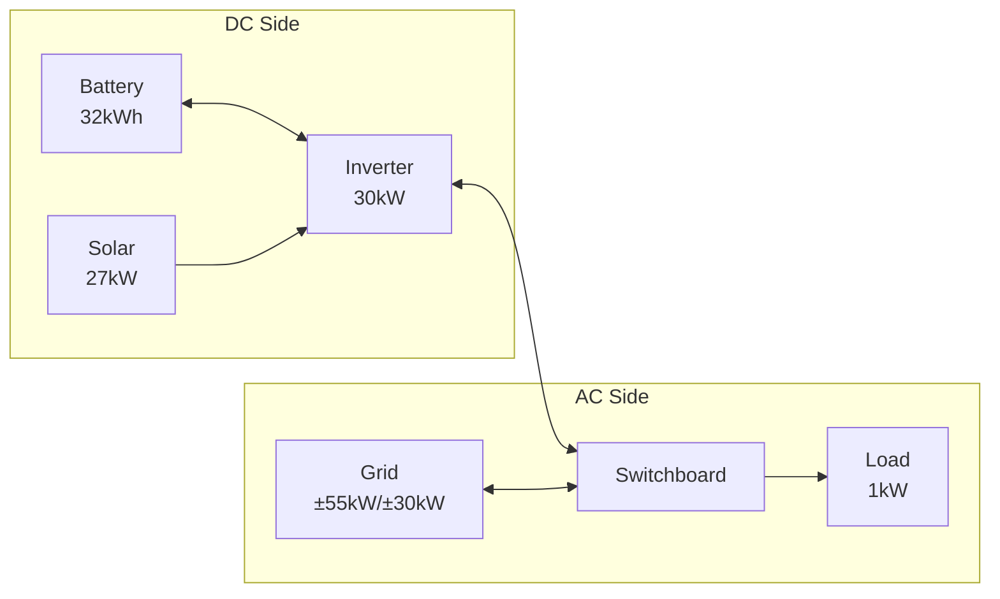

# Complete Example: Sigenergy System with Hybrid Inverter

This guide demonstrates configuring a Sigenergy system with hybrid inverter architecture, multiple solar arrays, and grid connection.

## System Overview

This example uses the test system configuration:

- **Battery**: 32 kWh (Sigenergy SigenStor), 99% efficiency
- **Solar**: 27 kW peak (four orientations: East, North, South, West)
- **Inverter**: 30 kW hybrid inverter (DC/AC coupling)
- **Grid**: 55 kW import limit, 30 kW export limit
- **Load**: 1 kW constant base load



## Prerequisites

Before starting this configuration, ensure you have:

### Required Integrations

- **HAEO**: Installed via HACS (see [Installation guide](../user-guide/installation.md))
- **Sigenergy**: Provides battery capacity and SOC sensors
- **Solar Forecast**: [Open-Meteo Solar Forecast](https://www.home-assistant.io/integrations/open_meteo_solar_forecast/) integration
- **Electricity Pricing**: Any integration providing import/export price forecasts

### Configuration Requirements

- Multiple solar array orientations configured in forecast integration
- Battery SOC sensor available from Sigenergy integration
- Constant load value determined (see [Load configuration](../user-guide/elements/load.md#determining-your-baseline))

## Configuration Steps

### Step 1: Log In and Add HAEO

Log in to your Home Assistant instance, navigate to **Settings → Devices & services**, and add the HAEO integration.
Enter a name for your energy network — this example uses "Sigenergy System".

```guide
login(page)

add_integration(
    page,
    network_name="Sigenergy System",
)
```

After submitting, you should see a Switchboard element already exists.
This is the AC power balance point where grid and loads connect.

### Step 2: Add Inverter

The Inverter element models your hybrid inverter with its built-in DC bus.
Battery and solar will connect to this element.

```guide
add_inverter(
    page,
    name="Inverter",
    connection="Switchboard",
    max_power_source_target=EntityInput("max active power", "Sigen Plant Max Active Power"),
    max_power_target_source=EntityInput("max active power", "Sigen Plant Max Active Power"),
)
```

!!! tip "Selecting Sensors"

    In the entity picker, search for "max active power" to find the sensor.
    HAEO entity pickers search by **friendly name**, not entity ID.

### Step 3: Add Battery

Configure the Sigenergy battery, connecting to the Inverter's DC side.

```guide
add_battery(
    page,
    name="Battery",
    connection="Inverter",
    capacity=EntityInput("rated energy", "Rated Energy Capacity"),
    initial_charge_percentage=EntityInput("state of charge", "Battery State of Charge"),
    max_power_target_source=EntityInput("rated charging", "Rated Charging Power"),
    max_power_source_target=EntityInput("rated discharging", "Rated Discharging Power"),
    min_charge_percentage=ConstantInput(10),
    max_charge_percentage=ConstantInput(100),
)
```

!!! tip "Searching for Battery Sensors"

    Use these search terms in entity pickers:

    - "rated energy capacity" for battery capacity
    - "state of charge" for current SOC
    - "charging" for max charge power
    - "discharging" for max discharge power

### Step 4: Add Solar

Configure solar arrays with forecast sensors for each orientation, connecting to the Inverter's DC side.

```guide
add_solar(
    page,
    name="Solar",
    connection="Inverter",
    forecast=[
        EntityInput("east solar today", "East solar production forecast"),
        EntityInput("north solar today", "North solar production forecast"),
        EntityInput("south solar today", "South solar prediction forecast"),
        EntityInput("west solar today", "West solar production forecast"),
    ],
)
```

!!! tip "Multi-Select Entity Pickers"

    For fields that accept multiple sensors, an "Add entity" button appears after selecting the first sensor.
    Click it to add additional sensors one at a time.

### Step 5: Add Grid Connection

Configure grid with pricing and limits, connecting to the Switchboard.

```guide
add_grid(
    page,
    name="Grid",
    connection="Switchboard",
    price_source_target=[
        EntityInput("general price", "Home - General Price"),
        EntityInput("general forecast", "Home - General Forecast"),
    ],
    price_target_source=[
        EntityInput("feed in price", "Home - Feed In Price"),
        EntityInput("feed in forecast", "Home - Feed In Forecast"),
    ],
    max_power_source_target=ConstantInput(55),
    max_power_target_source=ConstantInput(30),
)
```

!!! tip "Finding Price Sensors"

    Search for "General Price" for import pricing and "Feed In" for export pricing.
    Your integration may use different naming.
    Look for sensors with price forecast attributes.

### Step 6: Add Load

Configure the base load consumption, connecting to the Switchboard.

```guide
add_load(
    page,
    name="Constant Load",
    connection="Switchboard",
    forecast=ConstantInput(1),
)
```

!!! tip "Load Sensors"

    If you don't have a load forecast, create an `input_number` helper for constant load:

    1. Settings → Devices & Services → Helpers
    2. Create Helper → Number
    3. Name: "Constant Load Power", Unit: kW, Value: 1.0

### Step 7: Verify Setup

After completing configuration, verify that all elements were created successfully.

```guide
verify_setup(page)
```

## Verification

Navigate to **Settings → Devices & Services → HAEO** and click on "Sigenergy System" to view the device page.

### Expected Device Hierarchy

In the HAEO integration page, you should see:

| Element          | Type     | Entities |
| ---------------- | -------- | -------- |
| Sigenergy System | Network  | Varies   |
| Switchboard      | Node     | Varies   |
| Inverter         | Inverter | Varies   |
| Battery          | Battery  | Varies   |
| Solar            | Solar    | Varies   |
| Grid             | Grid     | Varies   |
| Constant Load    | Load     | Varies   |

### Key Sensors to Monitor

**Network-level**:

- `sensor.sigenergy_system_optimization_cost` - Total forecasted cost (\$)
- `sensor.sigenergy_system_optimization_status` - Should show "success"
- `sensor.sigenergy_system_optimization_duration` - Solve time (seconds)

**Battery**:

- `sensor.battery_power_charge` - Charging power (kW)
- `sensor.battery_power_discharge` - Discharging power (kW)
- `sensor.battery_energy_stored` - Current energy level (kWh)
- `sensor.battery_state_of_charge` - SOC percentage (%)

**Solar**:

- `sensor.solar_power` - Optimal generation (kW)
- `sensor.solar_forecast_limit_shadow_energy_price` - Value of additional generation capacity (\$/kWh)

**Grid**:

- `sensor.grid_power_import` - Import from grid (kW)
- `sensor.grid_power_export` - Export to grid (kW)
- `sensor.grid_cost_import` - Import cost (\$)
- `sensor.grid_revenue_export` - Export revenue (\$)

**Load**:

- `sensor.load_power` - Load consumption (kW)

**Inverter**:

- `sensor.inverter_power_dc_to_ac` - DC→AC power flow (kW)
- `sensor.inverter_power_ac_to_dc` - AC→DC power flow (kW)
- `sensor.inverter_power_active` - Net AC power (kW)

All sensors include a `forecast` attribute with future optimized values.

!!! tip "Inspecting Device Details"

    Click on any device in the HAEO integration page to see:

    - All sensors created by that element
    - Current sensor values and states
    - Forecast attributes (click on sensor → attributes tab)
    - Entity IDs for use in automations

    This is helpful for understanding what data each element provides and troubleshooting configuration issues.

## Architecture Notes

This hybrid inverter configuration uses the Inverter element which provides:

- **Built-in DC bus** for battery and solar connections
- **Bidirectional AC/DC conversion** with power limits
- **AC connection** to the Switchboard where grid and loads connect

The Inverter element simplifies configuration compared to manual DC/AC nets with connection elements, while accurately modeling:

- DC→AC export cannot exceed inverter rating
- AC→DC charging cannot exceed inverter rating
- Battery and solar share the DC bus capacity

See [Node](../user-guide/elements/node.md) for more on hybrid inverter modeling.

## Next Steps

<div class="grid cards" markdown>

- :material-battery-charging:{ .lg .middle } **Battery configuration**

    ---

    Review battery settings and partition options.

    [:material-arrow-right: Battery guide](../user-guide/elements/battery.md)

- :material-flash:{ .lg .middle } **Inverter configuration**

    ---

    Tune DC/AC power limits and efficiencies.

    [:material-arrow-right: Inverter guide](../user-guide/elements/inverter.md)

- :material-chart-line:{ .lg .middle } **Forecasts and sensors**

    ---

    Ensure pricing and solar forecasts cover your horizon.

    [:material-arrow-right: Forecasts guide](../user-guide/forecasts-and-sensors.md)

- :material-graph:{ .lg .middle } **Optimization results**

    ---

    Interpret costs, power flows, and shadow prices.

    [:material-arrow-right: Optimization guide](../user-guide/optimization.md)

</div>
